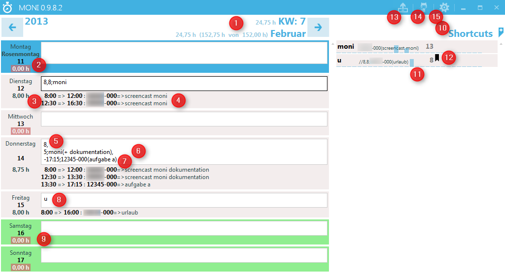
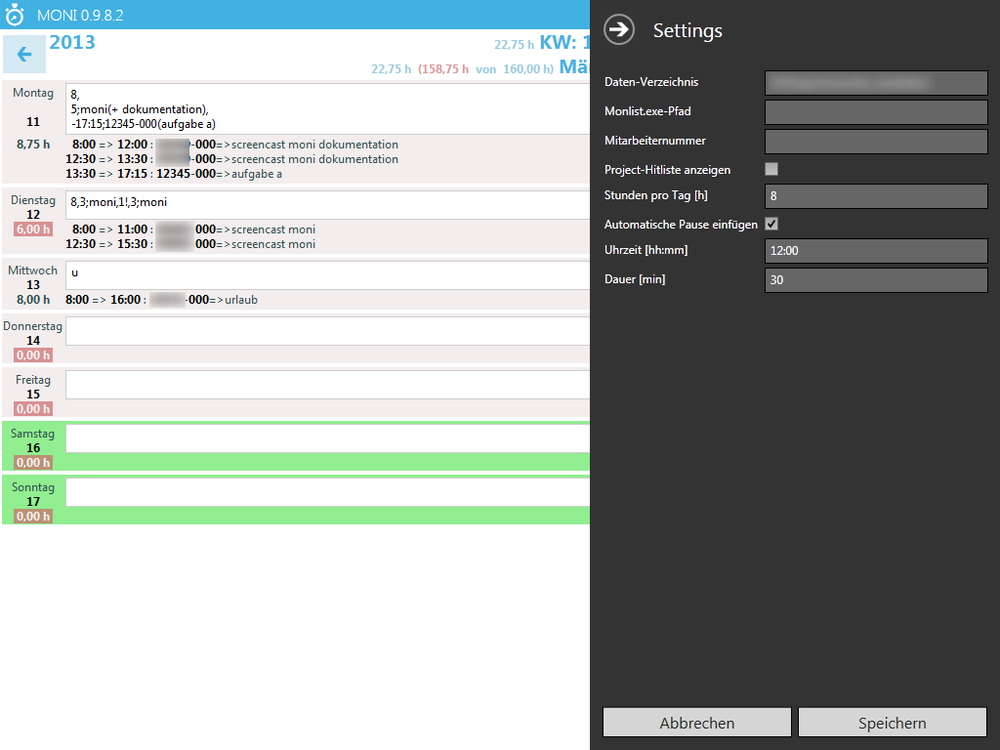

# Moni - Der schnellere Deg Stunden zu erfassen #

## Die Idee ##

Die Idee bei Moni ist, dass es bei der Stundenerfassung nicht so sehr auf exakte Uhrzeiten ankommt, sondern auf die Stunden Anzahl. Deshalb bietet Moni eine einfache Möglichkeit Stundenaufwände einzugeben und trotzdem Start und Endzeiten aufzuzeichnen, sowie automatische Pauseneinträge zu erzeugen. die Eingabe besteht aus einem bestimmten Format, dass unten beschrieben ist. Am Anfang ist es ein bisschen gewöhnungsbedüftig, aber man kann es schnell lernen. 

Außerdem bietet Moni weitere Features, die die Eingabe vereinfachen:

- Wochenweise Ansicht
- Automatische Pauseneintragung (und Deaktivierung für einzelne Tage)
- Abkürzungen für Projekte und Beschreibung
- Abkürzungen für ganze Tage
- Anzeige Stunden pro Projekt/Abkürzung
- Prognose Arbeitsstunden
- Keyboardnavigation

## Das Interface ##

1. Prognose Arbeitstunden
2. Warnung wenn nicht 8h pro Tag verbraucht
3. Automatische Pauseneintragung
4. Hervorhebung Feiertage
5. Mehrzeilige Einträge
6. Beschreibungen von Abkürzungen ersetzen
7. Beschreibungen von Abkürzungen erweiteren
8. Abkürzungen für ganze Tage
9. Hervorhebung Wochenende
10. Abkürzungen mit Nutzungsstatistik, können in direkt hinzugefügt werden
11. Editieren von Abkürzungen (erscheint beim Mouseover)
12. Hervorhebung von Abkürzungen für ganze Tage
13. Hitliste der Abkürzuungen
14. Link zu Github
15. Einstellungen editieren

## Installation ##

1. Aktuelle Versionen [hier](https://github.com/dotob/moni/tree/master/dist) runterladen.
2. Zip entpacken
3. Moni.exe starten
4. Es wird beim Start ein **data** Verzeichnis angelegt. Der Ort dieses Verzeichnis kann geändert werden:
5. Ab Version 0.9.8.0 können die Einstellungen zum Teil direkt im Hauptfenster geändert werden
6. Shortcuts können seit Version 0.9.7.0 direkt im Interface geändert werden

## Keyboad Shortcuts ##

### Navigation ####

- **tab**: In Eingabefeld des vorigen Tages gehen
- **shift+tab**: In Eingabefeld des folgenden Tages gehen
- **strg+cursor_links**: Vorige Woche anzeigen
- **strg+cursor_rechts**: Nächste Woche anzeigen
- **escape**: Gehe zu Heute

### Andere ###
- **strg+u**: Eingabe des letzten Tages hierhin kopieren

# Dokumentation der Eingabe #

## Ganz einfach: Ein Eintrag ##

Eingabe: 

**8,8;12345-000**

Ausgabe: 

- 8:00-16:00 12345-000

Erläuterung: 

Erste Zahl vor dem Komma ist die Startzeit, gefolgt von der Anzahl der Stunden und Project-Position

## Mehrere Einträge ##

Eingabe: 

**8,4;12345-000,4;54321-000**

Ausgabe: 

- 8:00-12:00 12345-000
- 12:00-16:00 54321-000

Erläuterung: 

Kommasepariert werde die Einträge aneinandergereiht

## Teilstunden ##

Eingabe: 

**8:30,4.25;12345-000,3.75;54321-000**

Ausgabe: 

- 8:30-12:45 12345-000
- 12:45-16:30 54321-000

Erläuterung: 

Uhrzeiten werden im Format **stunde:minute** angegeben. Stunden mit **punkt** getrennt

## Beschreibungen ##

Eingabe: 

**8:30,4.25;12345-000(fehlerbehebung),3.75;54321-000(support)**

Ausgabe: 

- 8:30-12:45 12345-000  fehlerbehebung
- 12:45-16:30 54321-000  support

Erläuterung: 

Beschreibungen können pro Eintrag in **klammern** angegeben werden

## Abkürzungen ##

Konfiguration:

**ctb => 12345-000**
**ktl => 54321-000(spezifikation)**

Eingabe: 

**8:30,4.25;ctb,3.75;ktl**

Ausgabe: 

- 8:30-12:45 12345-000
- 12:45-16:30 54321-000  spezifikation

## Abkürzungen und Beschreibungen ##

Konfiguration:

- **ctb => 12345-000**
- **ktl => 54321-000(spezifikation)**

Eingabe: 

**8:30,4.25;ctb(support),2.75;ktl(spezifikation schnittstelle),1;ktl(+ bahn)**

Ausgabe: 

- 8:30-12:45 12345-000  support
- 12:45-15:30 54321-000  spezifikation schnittstelle
- 15:30-17:30 54321-000  spezifikation schnittstelle bahn

Erläuterung: 

Abkürzungen können auch Beschreibungen enthalten. Wird die Abkürzung mit Beschreibung eingegeben wird diese angefügt ("(+ )") oder ersetzt ("( )") die Beschreibung der Abkürzung

## Abkürzungen für einen ganzen Tag ##

Konfiguration:

- **krank => 8,8;12345-000(krank oder doc)** (WholeDayExpansion  = true, siehe settings.json erläuterung)

Eingabe: 

**krank**

Ausgabe: 

- 8:00-16:00 12345-000  krank oder doc

## Manuelle Pause ##

Eingabe: 

**8:00,4;12345-000,1!,4;12345-000**

Ausgabe: 

- 8:00-12:00 12345-000
- 13:00-17:00 12345-000

Erläuterung: 

Endet ein Eintrag mit **!** dann wird die folgende Stundenzahl als Pause eingefügt

## Automatische Pause ##

Konfiguration:

- **pause einfügen**
- **pause um 12:00**
- **pausenlänge 30min**

Eingabe: 

**8:00,8;12345-000**

Ausgabe: 

- 8:00-12:00 12345-000
- 12:30-16:30 12345-000

Erläuterung: 

Es wird automatisch ein Pause um 12:00 eingefügt

## Automatische Pause für einen Tag deaktivieren ##

Konfiguration:

- **pause einfügen**
- **pause um 12:00**
- **pausenlänge 30min**

Eingabe: 

**//8:00,8;12345-000**

Ausgabe: 

- 8:00-16:30 12345-000

Erläuterung:

mit "//" kann das Einfügen einer automatischen Pause für diesen Tag ausgeschaltet werden

## Endzeit statt Stunden anzahl ##

Eingabe: 

**8:00,-16;12345-000**

Ausgabe: 

- 8:00-16:00 12345-000

Erläuterung: 

Statt der Stunden Anzahl kann auch eine Zeit eingegeben werden, diese muß dann mit **-** prefixed werden. Automatische Pausen werden dabei ebenfalls berücksichtigt

